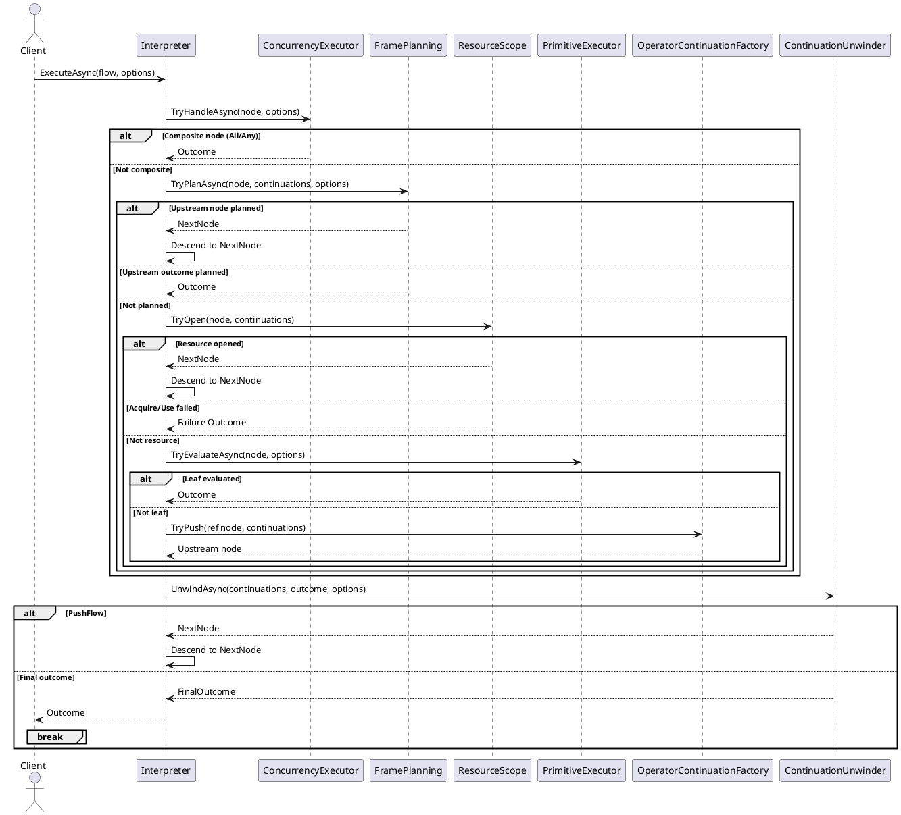

# Under the Hood: The Flow Execution Engine

How do you execute a complex, deeply nested workflow with thousands of steps without blowing the call stack? This was the central problem Flow was designed to solve.

Flow's solution is a **trampoline-based execution engine**. Instead of making deeply recursive function calls, the engine uses a simple, tight loop that processes one step of the flow at a time. This keeps the stack depth constant and makes the entire execution process safe, predictable, and debuggable.

This document explains how it works.

## 1. The Core Mechanics: AST & The Trampoline

Every flow you write is a declarative "recipe" of what to do. This recipe is stored as an Abstract Syntax Tree (AST)—an immutable tree of nodes representing each operation (`Select`, `Chain`, `WithResource`, etc.).

The `FlowEngine` is the interpreter that runs the recipe. It walks the AST and executes the work in a three-phase loop:

1.  **Descend:** The engine travels down the AST to find the next piece of work.
2.  **Evaluate:** It executes the operation at that node (e.g. running your code in a `Create` or `Chain` operator). This produces an `Outcome`.
3.  **Unwind:** It applies any pending continuations to the `Outcome`. A continuation is a small function that handles the result of a previous step (e.g. a `Validate` check or a `Recover` block). This may produce the final result or point the engine to the next part of the flow to execute.

This loop repeats until the final outcome is produced.

## 2. Key Design Decisions

Several important, deliberate decisions are integral to Flow's engine design.

### 2.1. Why Flow Merges Adjacent `Select` Operations

`Select` transforms a value. It's a pure, side-effect-free operation. When you have several `Select<T, T>` calls in a row, Flow merges them into a single, optimised function.

This is a safe internal optimisation that reduces overhead, resulting in fewer continuations and better performance. Flow doesn't merge across type boundaries, so the behaviour remains predictable and type-safe.

### 2.2. Why Flow Does *Not* Merge `Chain`

In contrast, Flow deliberately treats `Chain` as a hard execution boundary. Each `Chain` call represents a distinct, failable operation that may have side effects. Merging them would break the guarantees it aims to provide:

*   **Diagnostics:** Merging would erase the boundaries that observers and logs rely on, making debugging much harder.
*   **Behaviours:** Retry and Timeout behaviours are scoped to a specific `Chain`. Merging would smear these scopes and lead to unpredictable results.
*   **Resource Lifetimes:** `WithResource` depends on clear, explicit boundaries.

For these reasons, `Chain` nodes are first-class citizens and are never merged.

## 3. Code Organisation

The engine's code is organised by phase to keep concerns separate and the code easy to navigate.

*   **`BahmanM.Flow.Execution.Engine`**: The central orchestrator and phase helpers.
*   **`BahmanM.Flow.Execution.Planning`**: Planners that prepare continuations for each operator. This is where Flow implements logic like merging `Select` operations.
*   **`BahmanM.Flow.Execution.Continuations`**: The small continuation classes (`SelectCont`, `ChainCont`, `DisposeCont`, etc.) that contain the logic for each step.

## 4. Other Features

*   **Behaviours (Retry/Timeout):** Applied by rewriting the AST at declaration time, not by special-casing the interpreter. This keeps the engine simple.
*   **Diagnostics:** The engine itself does not log. Instead, you can attach observers via `FlowExecutionOptions` to listen for meaningful events.
*   **Resource Management (`WithResource`):** Mirrors C#'s `using` statement. Flow pushes a `DisposeCont` continuation to the stack, guaranteeing that disposal runs on success, failure, or exception.
*   **Concurrency (`All`/`Any`):** These operators are handled directly by the `ConcurrencyExecutor` to manage parallel execution and aggregate the results.

## 5. For Reference

### 5.1. Glossary

*   **AST (Abstract Syntax Tree):** A tree of immutable nodes that declare what the flow should do.
*   **Continuation:** A small unit of work that runs after an outcome is produced.
*   **Trampoline:** A loop that executes steps sequentially to avoid deep recursion and stack overflows.
*   **Planner:** Internal logic that prepares continuations for each operator.

### 5.2. Sequence Diagram

